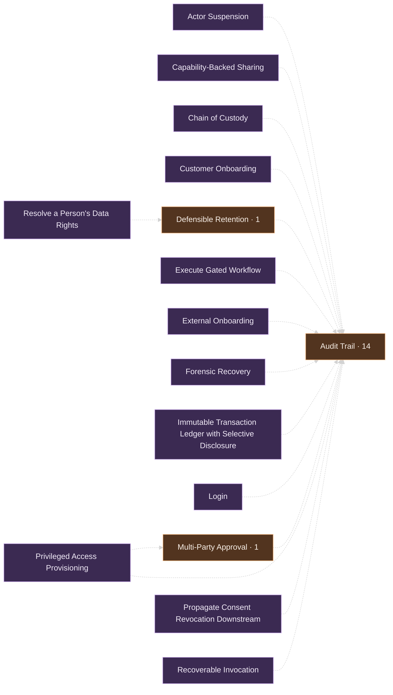

<!-- GENERATED by tools/taxonomy/generate_graph.py — do not hand-edit; regenerate with
     `python3 tools/taxonomy/generate_graph.py .`. Every edge and count below is derived
     from the corpus (Composes sections, Status lines, sibling model files). -->

# Composition Graph

The Intent Graph, rendered. Every diagram and count on this page is **derived** from the
corpus — the `## Composes` edges, the Status lines, the sibling formal-model files — and
regenerated by tooling, never hand-maintained (text is canonical; visuals are views). Visual
weight here is *semantic leverage*: how many compositions rest on a pattern — not lines of code.

## Reverse leverage — atoms by fan-in

How many grounded compositions compose each atom. A stale or wrong atom propagates exactly
this far — fan-in is the risk weight the rescan queue tie-breaks on, and the reuse a flat
pattern count hides.

| Atom | Fan-in | Composed by |
|---|---|---|
| [Permissions](./atoms/permissions.html) | 8 | actor-suspension, attributed-permissions-admin, execute-gated-workflow, multi-party-approval, privileged-access-provisioning, propagate-consent-revocation-downstream, session-gated-authorization, shared-todo |
| [Credential](./atoms/credential.html) | 5 | actor-suspension, authenticated-actor, external-onboarding, login, privileged-access-provisioning |
| [Event Log](./atoms/event-log.html) | 5 | audit-trail, compensable-workflow, preference-aware-notification-fanout, reserve-from-pool, undo-history |
| [Actor Identity](./atoms/actor-identity.html) | 4 | attributed-permissions-admin, audit-trail, authenticated-actor, reserve-from-pool |
| [Retention Window](./atoms/retention-window.html) | 4 | audit-trail, customer-onboarding, defensible-retention, propagate-consent-revocation-downstream |
| [Session](./atoms/session.html) | 4 | actor-suspension, login, privileged-access-provisioning, session-gated-authorization |
| [Assignment](./atoms/assignment.html) | 3 | execute-gated-workflow, multi-party-approval, shared-todo |
| [Selective Disclosure](./atoms/selective-disclosure.html) | 3 | capability-backed-sharing, immutable-transaction-ledger, resolve-a-persons-data-rights |
| [Approval Step](./atoms/approval-step.html) | 2 | execute-gated-workflow, multi-party-approval |
| [Capability](./atoms/capability.html) | 2 | capability-backed-sharing, privileged-access-provisioning |
| [Consent](./atoms/consent.html) | 2 | propagate-consent-revocation-downstream, resolve-a-persons-data-rights |
| [Duplicate Prevention](./atoms/duplicate-prevention.html) | 2 | idempotent-reservation, reserve-from-pool |
| [Notification](./atoms/notification.html) | 2 | notification-fanout, preference-aware-notification-fanout |
| [Party Identity](./atoms/party-identity.html) | 2 | customer-onboarding, external-onboarding |
| [Personal Todo](./atoms/personal-todo.html) | 2 | shared-todo, undo-history |
| [Provisional Commitment](./atoms/provisional-commitment.html) | 2 | idempotent-reservation, reserve-from-pool |
| [State Machine](./atoms/state-machine.html) | 2 | compensable-workflow, execute-gated-workflow |
| [Subscription](./atoms/subscription.html) | 2 | notification-fanout, preference-aware-notification-fanout |
| [Capacity Constraint Enforcement](./atoms/capacity-constraint-enforcement.html) | 1 | reserve-from-pool |
| [Invitation](./atoms/invitation.html) | 1 | external-onboarding |
| [lease](./atoms/lease.html) | 1 | recoverable-invocation |
| [Legal Hold](./atoms/legal-hold.html) | 1 | defensible-retention |
| [Message Preference](./atoms/message-preference.html) | 1 | preference-aware-notification-fanout |
| [Provenance](./atoms/provenance.html) | 1 | chain-of-custody |
| [Soft Delete](./atoms/soft-delete.html) | 1 | forensic-recovery |
| [Tamper Evidence](./atoms/tamper-evidence.html) | 1 | audit-trail |
| [Medication Order](./atoms/medication-order.html) | 0 | *(none yet)* |
| [Observation](./atoms/observation.html) | 0 | *(none yet)* |

## Reverse leverage — compositions as substrates

Compositions other compositions name in their `## Composes` (the substrate pattern —
constituents reached transitively). This is the load-bearing spine of the library.

| Substrate | Named by | Composers |
|---|---|---|
| [Audit Trail](./compositions/audit-trail.html) | 14 | actor-suspension, capability-backed-sharing, chain-of-custody, customer-onboarding, defensible-retention, execute-gated-workflow, external-onboarding, forensic-recovery, immutable-transaction-ledger, login, multi-party-approval, privileged-access-provisioning, propagate-consent-revocation-downstream, recoverable-invocation |
| [Defensible Retention](./compositions/defensible-retention.html) | 1 | resolve-a-persons-data-rights |
| [Multi-Party Approval](./compositions/multi-party-approval.html) | 1 | privileged-access-provisioning |

## The substrate spine

Compositions that build on other compositions. Arrows point from the composer to the
substrate it names; constituents of the substrate are reached transitively.

## The full graph

```mermaid
%%{init: {"theme": "dark", "flowchart": {"htmlLabels": true}} }%%
flowchart LR
  subgraph ATOMS[Atoms]
    a_actor_identity["Actor Identity · 4"]
    a_approval_step["Approval Step · 2"]
    a_assignment["Assignment · 3"]
    a_capability["Capability · 2"]
    a_capacity_constraint_enforcement["Capacity Constraint Enforcement · 1"]
    a_consent["Consent · 2"]
    a_credential["Credential · 5"]
    a_duplicate_prevention["Duplicate Prevention · 2"]
    a_event_log["Event Log · 5"]
    a_invitation["Invitation · 1"]
    a_lease["lease · 1"]
    a_legal_hold["Legal Hold · 1"]
    a_medication_order["Medication Order"]
    a_message_preference["Message Preference · 1"]
    a_notification["Notification · 2"]
    a_observation["Observation"]
    a_party_identity["Party Identity · 2"]
    a_permissions["Permissions · 8"]
    a_personal_todo["Personal Todo · 2"]
    a_provenance["Provenance · 1"]
    a_provisional_commitment["Provisional Commitment · 2"]
    a_retention_window["Retention Window · 4"]
    a_selective_disclosure["Selective Disclosure · 3"]
    a_session["Session · 4"]
    a_soft_delete["Soft Delete · 1"]
    a_state_machine["State Machine · 2"]
    a_subscription["Subscription · 2"]
    a_tamper_evidence["Tamper Evidence · 1"]
  end
  subgraph COMPS[Compositions]
    c_actor_suspension["Actor Suspension"]
    c_attributed_permissions_admin["Attributed Permissions Admin"]
    c_audit_trail["Audit Trail"]
    c_authenticated_actor["Authenticated Actor"]
    c_capability_backed_sharing["Capability-Backed Sharing"]
    c_chain_of_custody["Chain of Custody"]
    c_compensable_workflow["Compensable Workflow"]
    c_customer_onboarding["Customer Onboarding"]
    c_defensible_retention["Defensible Retention"]
    c_execute_gated_workflow["Execute Gated Workflow"]
    c_external_onboarding["External Onboarding"]
    c_forensic_recovery["Forensic Recovery"]
    c_idempotent_reservation["Idempotent Reservation"]
    c_immutable_transaction_ledger["Immutable Transaction Ledger with Selective Disclosure"]
    c_login["Login"]
    c_multi_party_approval["Multi-Party Approval"]
    c_notification_fanout["Notification Fanout"]
    c_preference_aware_notification_fanout["Preference-Aware Notification Fanout"]
    c_privileged_access_provisioning["Privileged Access Provisioning"]
    c_propagate_consent_revocation_downstream["Propagate Consent Revocation Downstream"]
    c_recoverable_invocation["Recoverable Invocation"]
    c_reserve_from_pool["Reserve from Pool"]
    c_resolve_a_persons_data_rights["Resolve a Person's Data Rights"]
    c_session_gated_authorization["Session-Gated Authorization"]
    c_shared_todo["Shared Todo"]
    c_undo_history["Undo History"]
  end
  c_actor_suspension --> a_permissions
  c_actor_suspension --> a_session
  c_actor_suspension --> a_credential
  c_attributed_permissions_admin --> a_permissions
  c_attributed_permissions_admin --> a_actor_identity
  c_audit_trail --> a_event_log
  c_audit_trail --> a_actor_identity
  c_audit_trail --> a_retention_window
  c_audit_trail --> a_tamper_evidence
  c_authenticated_actor --> a_credential
  c_authenticated_actor --> a_actor_identity
  c_capability_backed_sharing --> a_capability
  c_capability_backed_sharing --> a_selective_disclosure
  c_chain_of_custody --> a_provenance
  c_compensable_workflow --> a_state_machine
  c_compensable_workflow --> a_event_log
  c_customer_onboarding --> a_party_identity
  c_customer_onboarding --> a_retention_window
  c_defensible_retention --> a_legal_hold
  c_defensible_retention --> a_retention_window
  c_execute_gated_workflow --> a_state_machine
  c_execute_gated_workflow --> a_approval_step
  c_execute_gated_workflow --> a_permissions
  c_execute_gated_workflow --> a_assignment
  c_external_onboarding --> a_invitation
  c_external_onboarding --> a_credential
  c_external_onboarding --> a_party_identity
  c_forensic_recovery --> a_soft_delete
  c_idempotent_reservation --> a_provisional_commitment
  c_idempotent_reservation --> a_duplicate_prevention
  c_immutable_transaction_ledger --> a_selective_disclosure
  c_login --> a_credential
  c_login --> a_session
  c_multi_party_approval --> a_approval_step
  c_multi_party_approval --> a_permissions
  c_multi_party_approval --> a_assignment
  c_notification_fanout --> a_subscription
  c_notification_fanout --> a_notification
  c_preference_aware_notification_fanout --> a_subscription
  c_preference_aware_notification_fanout --> a_notification
  c_preference_aware_notification_fanout --> a_message_preference
  c_preference_aware_notification_fanout --> a_event_log
  c_privileged_access_provisioning --> a_credential
  c_privileged_access_provisioning --> a_session
  c_privileged_access_provisioning --> a_permissions
  c_privileged_access_provisioning --> a_capability
  c_propagate_consent_revocation_downstream --> a_consent
  c_propagate_consent_revocation_downstream --> a_permissions
  c_propagate_consent_revocation_downstream --> a_retention_window
  c_recoverable_invocation --> a_lease
  c_reserve_from_pool --> a_provisional_commitment
  c_reserve_from_pool --> a_capacity_constraint_enforcement
  c_reserve_from_pool --> a_duplicate_prevention
  c_reserve_from_pool --> a_event_log
  c_reserve_from_pool --> a_actor_identity
  c_resolve_a_persons_data_rights --> a_selective_disclosure
  c_resolve_a_persons_data_rights --> a_consent
  c_session_gated_authorization --> a_session
  c_session_gated_authorization --> a_permissions
  c_shared_todo --> a_personal_todo
  c_shared_todo --> a_permissions
  c_shared_todo --> a_assignment
  c_undo_history --> a_personal_todo
  c_undo_history --> a_event_log
  c_actor_suspension -.-> c_audit_trail
  c_capability_backed_sharing -.-> c_audit_trail
  c_chain_of_custody -.-> c_audit_trail
  c_customer_onboarding -.-> c_audit_trail
  c_defensible_retention -.-> c_audit_trail
  c_execute_gated_workflow -.-> c_audit_trail
  c_external_onboarding -.-> c_audit_trail
  c_forensic_recovery -.-> c_audit_trail
  c_immutable_transaction_ledger -.-> c_audit_trail
  c_login -.-> c_audit_trail
  c_multi_party_approval -.-> c_audit_trail
  c_privileged_access_provisioning -.-> c_audit_trail
  c_privileged_access_provisioning -.-> c_multi_party_approval
  c_propagate_consent_revocation_downstream -.-> c_audit_trail
  c_recoverable_invocation -.-> c_audit_trail
  c_resolve_a_persons_data_rights -.-> c_defensible_retention
  classDef atom fill:#16394a,stroke:#85c1e9,color:#eaf6fc;
  classDef atomSec fill:#16394a,stroke:#f7dc6f,color:#fdfbef;
  classDef comp fill:#3b2a52,stroke:#c7a8e8,color:#f2ebfa;
  classDef compReg fill:#52341f,stroke:#f0b27a,color:#fdf2e9;
  class a_actor_identity,a_approval_step,a_assignment,a_capability,a_capacity_constraint_enforcement,a_consent,a_credential,a_duplicate_prevention,a_event_log,a_invitation,a_lease,a_legal_hold,a_medication_order,a_message_preference,a_notification,a_observation,a_party_identity,a_permissions,a_personal_todo,a_provenance,a_provisional_commitment,a_retention_window,a_selective_disclosure,a_session,a_soft_delete,a_state_machine,a_subscription,a_tamper_evidence atom;
  class a_actor_identity,a_approval_step,a_assignment,a_capability,a_credential,a_invitation,a_party_identity,a_permissions,a_session atomSec;
  class c_actor_suspension,c_attributed_permissions_admin,c_audit_trail,c_authenticated_actor,c_capability_backed_sharing,c_chain_of_custody,c_compensable_workflow,c_customer_onboarding,c_defensible_retention,c_execute_gated_workflow,c_external_onboarding,c_forensic_recovery,c_idempotent_reservation,c_immutable_transaction_ledger,c_login,c_multi_party_approval,c_notification_fanout,c_preference_aware_notification_fanout,c_privileged_access_provisioning,c_propagate_consent_revocation_downstream,c_recoverable_invocation,c_reserve_from_pool,c_resolve_a_persons_data_rights,c_session_gated_authorization,c_shared_todo,c_undo_history comp;
  class c_actor_suspension,c_attributed_permissions_admin,c_audit_trail,c_authenticated_actor,c_capability_backed_sharing,c_chain_of_custody,c_compensable_workflow,c_customer_onboarding,c_defensible_retention,c_execute_gated_workflow,c_external_onboarding,c_forensic_recovery,c_idempotent_reservation,c_immutable_transaction_ledger,c_login,c_multi_party_approval,c_notification_fanout,c_preference_aware_notification_fanout,c_privileged_access_provisioning,c_propagate_consent_revocation_downstream,c_recoverable_invocation,c_reserve_from_pool,c_resolve_a_persons_data_rights,c_session_gated_authorization,c_shared_todo,c_undo_history compReg;
```

Every composition → atom edge (64 edges — expand)

**Legend.** Blue nodes: atoms (yellow border: the derived *security* overlay). Purple nodes:
compositions (orange fill: regulated — the composition carries a Generation acceptance bar;
in the spine diagram, orange marks compositions used as substrates). Dotted arrows: substrate
edges. `· N` on a node is its fan-in.

---

Catalogs: [Atomic Concepts](./atoms/) · [Conceptual Compositions](./compositions/). The
classification lenses behind the coloring are documented in the
[taxonomy note](./atoms/TAXONOMY.html).
