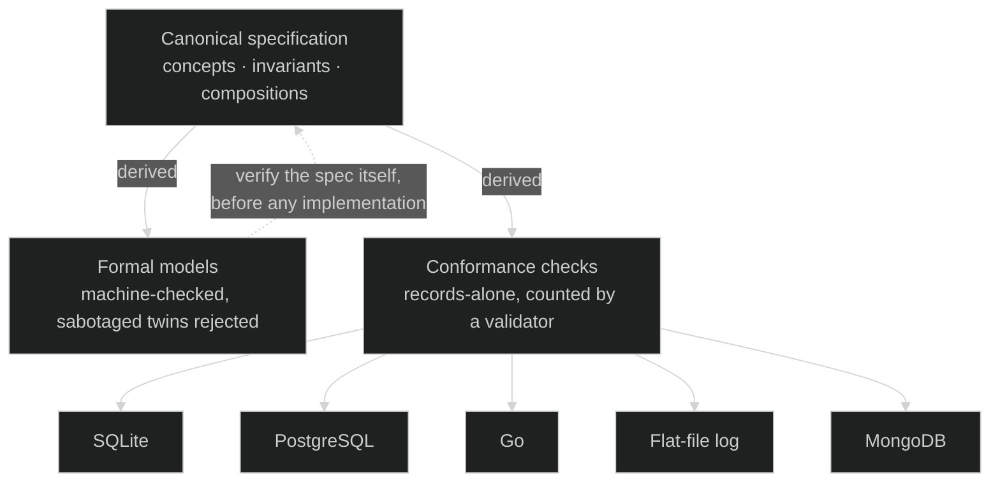

# Earning "Source of Truth"

Table of contents

{: .text-delta }
1. TOC
{:toc}

> Everyone now declares the spec a source of truth. The hard word is *truth* — a source whose own correctness can be shown, and that settles disagreements. This page is where Grace Commons sits in that lineage: what the 2024–26 spec-driven wave validated, which parts of the problem earlier traditions each solved and the gaps they left, and the three specific costs this library pays that turn the declaration into a demonstrable property. The claims here are the measured kind — each one links to something you can [run yourself](./verify.html).

## Two senses of "single source of truth"

There is a **bookkeeping** sense: one canonical place the intent lives, no duplication. And there is an **epistemic** sense: a source whose own correctness can be *shown*, and that *adjudicates* every disagreement — when spec and implementation differ, the spec is right by construction, because the spec is the thing that was verified.

The spec-driven development wave of 2024–26 — GitHub Spec Kit, AWS Kiro, Tessl, OpenSpec, and their peers — reached the first sense and borrowed the language of the second. That wave did this library an enormous favor: it validated the premise (spec as source of truth) and taught the market the vocabulary. But "source of truth" with no way to verify the source is just "the artifact we agreed to treat as primary." **Primary is not the same as true.**

Two tells mark the gap, observable in the wave's own practice. The first is **drift direction**: the emerging discipline is "update the spec alongside every change," and the emerging metric is *drift rate* — how fast the spec falls behind the code. A spec that chases the code is documentation with better hygiene; the code holds authority. Here the direction is inverted — implementations chase the spec, and the measured quantity is *conformance*. The second is the **verification floor**: in the wave's practice, "machine-checkable spec" typically means schema linting — the spec file is well-formed. Here it means the records an implementation produces provably honor the spec's claims, counted by a validator, across independent implementations.

None of this is a hypothetical separation. The same specification surface here renders into five materially different implementations — SQLite, PostgreSQL, Go, a flat-file log, and a document store with no relational constraint enforcement at all — and a validator measures invariant preservation across every one of them, identically ([the demos](./demos.html); [run it yourself](./verify.html)). The philosophy below has that proof standing behind it.

## The name encodes the claim

The wave calls its practice Intent-Driven (or Spec-Driven) *Development*: intent in, AI-generated code out. This library's discipline is **Intent-Driven *Design***: the intent itself is the designed artifact — concepts, invariants, compositions — not merely the input to a generation pipeline. (*Design* is also Daniel Jackson's word: *The Essence of Software — Why Concepts Matter for Great Design*.)

The two are not rivals. Intent-Driven Development drives the *build* from intent; Intent-Driven Design makes the intent *worth building from* — and the former runs happily on top of the latter. The relationship is fulfillment, not competition: the movement declares the spec the single source of truth, and this library supplies the machinery that makes the declaration true.

## What it costs to earn the word — three conditions

**1. All domain meaning lives in the spec, as complete invariant contracts.** Invariants that must hold in *every* state — not a sample of behaviors. This is what lets the spec adjudicate: "is this implementation correct?" becomes "does it preserve the invariants?", answerable from the spec alone. Jackson's concept design supplies exactly this discipline — it is the half that example-based specification (BDD's scenarios) and prose specification (the SDD wave's documents) never had. Every pattern in this library carries its numbered invariant set; the [pressure-testing methodology](./pressure-testing.html) is what forces them complete.

**2. The spec's own truth is checkable without an implementation.** A derived formal model establishes that the invariants are mutually consistent and preserved under every interleaving within bounds — with a deliberately-sabotaged twin the checker must reject, proving the check has teeth. Until this exists, correctness is established by *running code*, which quietly makes the implementation the source and the spec downstream. Here, every pattern whose formal-layer vote is yes ships a machine-checked model and a rejected buggy twin ([run them](./verify.html)).

**3. Any implementation introduces only meaning-free truth, conformance-enforced.** *Meaning-free* is precise, not rhetorical: an implementation holds real truths — which lock serializes the log, which index enforces uniqueness — but they are truths about *mechanism*, never about the *domain*. The obligation/realization boundary keeps that how — which database, which lock, which engine — below the contract, and conformance validates the observable contract, never the realization. The worked proof is the [Beacon render family](./demos.html): the same specs on SQLite, PostgreSQL, Go, a flat-file log, and MongoDB — an engine with no foreign keys, no CHECK constraints — and every spec invariant survived; only the *enforcement locus* moved. The spec stays the single source of *meaning* even though each realization holds its own meaning-free mechanics.

Example-based specification has enforcement but a partial spec — examples under-determine the system, so truth lives in the uncovered space. The SDD wave has the slogan but neither verifiability nor a meaning/mechanism boundary — the moment an agent fills a gap the spec didn't pin, truth lives outside the spec. This library is the intersection where all three conditions hold at once.

The whole relationship in one picture — the spec verified from above, the implementations measured from below:

## The lineage — what each solved, where each stopped

Every row below contributed something this library inherits; none is dismissed. The last column is the specific gap, not a verdict.

| Tradition | What it does at the spec level | Where it stops short of earned source-of-truth |
|---|---|---|
| **Formal methods** — Z, B/Event-B, TLA+, Alloy, seL4, SCADE | Spec canonical, verified, code derived or refined — correct-by-construction systems in rail signaling, cloud infrastructure, avionics | Optimized for proof precision, not for being the shared artifact across engineering, product, legal, operations, and domain experts — the notation excludes the very stakeholders whose logic it encodes |
| **Model-driven** — MDA, Executable UML | Model canonical, code generated; platform-independent models with many platform-specific renders — the "many renders" idea, decades early | Over-promised generation and round-trip and under-delivered; the canonical artifact was UML, not language a stakeholder reads |
| **Behavior-driven development** — North (~2006), Gherkin/Cucumber | Executable acceptance *scenarios* as shared spec; tests fail on drift — genuine conformance, years before the current wave | Scenarios are examples, not invariants: they sample the state space, so the truth of everything unsampled lives in the code |
| **Concept design** — Jackson, *The Essence of Software* (2021) | Concepts (one purpose; state + actions + invariants) composed by synchronizations; proposed a reusable concept catalog | It is the framework. This library is arguably its most concrete instantiation — plus the verification layer, the conformance boundary, and the build-artifact discipline. An extension, not a departure |
| **AI-era spec-driven development** (2024–26) — Spec Kit, Kiro, Tessl, OpenSpec | Specs as source of truth, code derived by agents — BDD's executable-spec insight, generalized and AI-driven | Declares the source of truth but cannot back it: the spec is neither invariant-complete nor self-verifiable, and with no meaning/mechanism boundary, agent gap-filling puts truth outside the spec |
| **Intent-Driven Design** — this library | The intent is the designed, verifiable artifact: Jackson's concepts + derived formal models + the conformance boundary | The intersection where the three conditions hold at once — inherited from the rows above, not invented against them. Its own gaps are declared in [Risks & Mitigations](./risks.html) |

## "Isn't this just—?"

**…model-driven architecture?** MDA generated one implementation and promised round-trip. This library conformance-checks *many independent* implementations and promises no round-trip — the weaker, honest claim that avoids MDA's wall. Independent renders agreeing identically is the evidence ([measured, not asserted](./verify.html)).

**…BDD?** BDD specs are examples; these specs are invariants. Examples enforce a sample; invariants adjudicate everything. BDD got the executable-spec idea right nearly two decades early, which makes it the honest precursor here — not a competitor.

**…the SDD wave with extra steps?** The wave *asserts* the spec is the source of truth; this library *demonstrates* it — invariants machine-checked, derivations conformance-bound, disagreement localized to the implementation at fault. The wave validated the premise. The extra steps are the earning.

**…Jackson's concept design?** Largely yes — deliberately. This library extends concept design with the spec-as-canonical-build-artifact commitment, derived formal validators with vacuity guards, the conformance boundary, and the AI-era readability bet (verbose canonical text, because AI removes the too-long-to-read barrier). Extension, not departure.

## What earning it buys — owning the meaning

The practical consequence is about lock-in. Vendor lock-in works because the vendor ends up owning your logic's *meaning* — your business rules live inside their system, so leaving means rewriting them from observation. When the spec is the verified source of meaning and every implementation is a conformance-checked realization *below* the contract, ownership inverts: **you own the meaning; you rent the mechanism — and you can swap the mechanism and prove the swap faithful.** The engine-swap render above is that promise demonstrated rather than made. The stance, precisely: not anti-cloud, not anti-service — anti-ransom. A vendor keeps your business by being good, not by holding your logic.

## What is common and what is yours — the corpus draws the line

Most of any regulated system is the same system. The survey that motivated Recoverable Invocation found twenty compositions in this library re-deriving one protocol in their own words — and that is the shape of every codebase: audit, retention, authentication, recoverable acts, written again by every team and verified by none. The corpus carries those once, in GRACE lang, read by the linter, proved where a model exists, gated. An adopter binds to them and writes nothing.

What is left after binding is, by construction, what is only yours — the pricing rule, the fraud score, the eligibility logic no other system has. It is written in the same language, its terms declared, in a spec you own: readable by your counsel and your engineers, and the source your implementations are derived from. None of it enters the corpus. A form enters the grammar only by recurrence across specifications ([`GRACE-lang.md`](./GRACE-lang.md) G2), and a pattern enters the corpus only by grounding; a rule that exists in one company's spec meets neither bar and stays that company's.

The line between the two is mechanical, not a consultant's judgement. Normalization ([`GRACE-lang.md`](./GRACE-lang.md) §16) reduces every obligation to one canonical form; an obligation that normalizes to a corpus rule, or cites one, is common; one that does not is yours. The reverse diff (§17) reports that split between two versions of one spec today; run against the corpus instead of a prior version, it reports the inventory of your novelty. That inventory is what a modernization delivers — the common four-fifths bound to a public, verified corpus; the novel fifth written down where it can be audited, licensed or defended; the whole portable, because a spec is the meaning and not the mechanism. The four-fifths is a claim to measure, not a figure to quote: the library's one measurement so far is the protocol survey above.

The stance follows from the one above. The corpus does not take your logic. It removes everything around your logic that was never yours to maintain, and leaves what is yours visible. A vendor who helps extract it holds no part of it.

## Honest concessions

Four, so this position survives pressure rather than merely sounding good. First: since the 2025 wave, the *stance* is no longer differentiating — the rigor is the entire moat, and it must keep being re-earned as the library grows (the gates on the [status page](./status.html) are that re-earning, automated). Second: the distinctive bet — a canonical layer in structured natural language rather than a formalism — carries a real question: is structured English rigorous enough to be a source of truth? The derived formal models and the conformance harness are the answer, and they must remain the answer at scale. Third: legibility framings make this position readable; only the verification layer makes it true. The two jobs are kept distinct on purpose. Fourth — scale, stated plainly: the three conditions are demonstrated on *today's* corpus, measured, not at every size. The library is young, formal checking is exhaustive only within declared bounds, and emergent-invariant coverage is a maintained discipline, not a law of nature; holding all three conditions at ten times the corpus is the open bet, and it is instrumented rather than assumed. And if the wave's tools grow real verification stories of their own, the moat narrows to what it always truly was — the verified corpus and the discipline that keeps it verified — which is a future this library would count as winning, not losing.

## The one-liner

Everyone now declares the spec a source of truth. The hard word is *truth* — a source whose correctness you can show and that settles disagreements. That costs invariant-complete concepts, a way to verify the spec without running it, and a boundary that keeps implementation choices meaning-free. This library pays all three. The movement calls its practice Intent-Driven Development and drives the build from intent; this is Intent-Driven *Design* — it makes the intent an artifact worth driving from. Not ahead of the movement: its fulfillment.

---

**Lineage sources.** Dan North, "Introducing BDD" (~2006) · Daniel Jackson, *The Essence of Software* (Princeton, 2021) · Mellor & Balcer, *Executable UML* (2002) · [Thoughtworks on spec-driven development](https://www.thoughtworks.com/en-us/insights/blog/agile-engineering-practices/spec-driven-development-unpacking-2025-new-engineering-practices) · [InfoQ — when architecture becomes executable](https://www.infoq.com/articles/spec-driven-development/) · [Fowler et al. — understanding SDD tools](https://martinfowler.com/articles/exploring-gen-ai/sdd-3-tools.html) · Formal-methods touchstones: B-Method/Event-B (Abrial), TLA+ (Lamport), Alloy (Jackson), seL4, SCADE.
